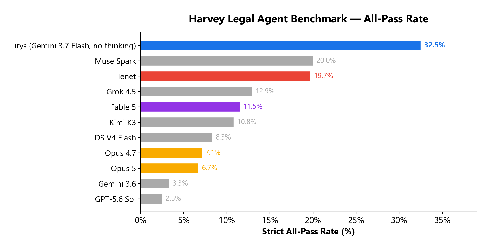
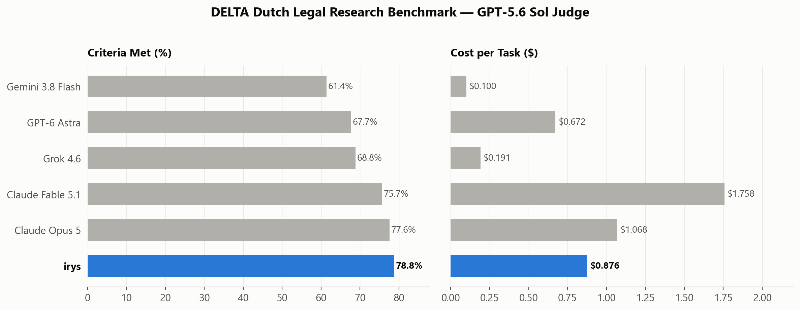
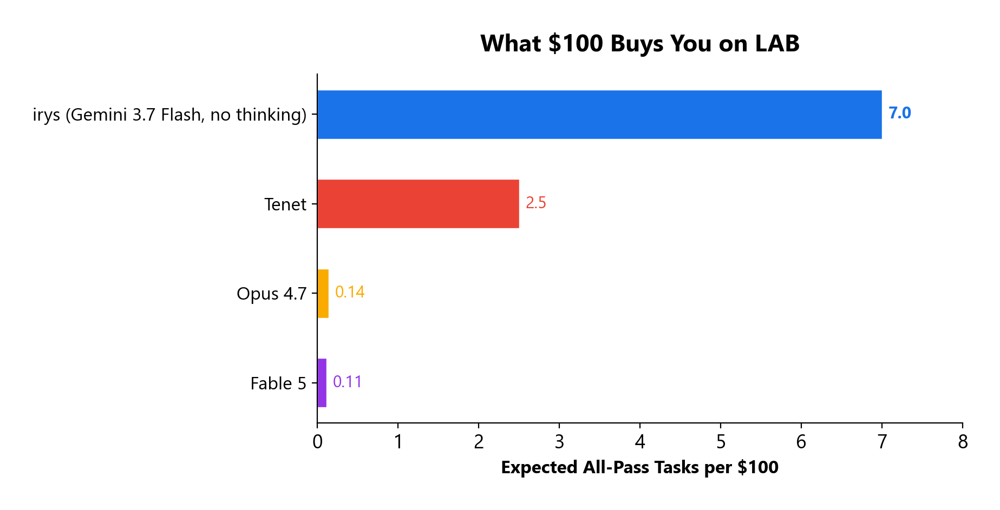
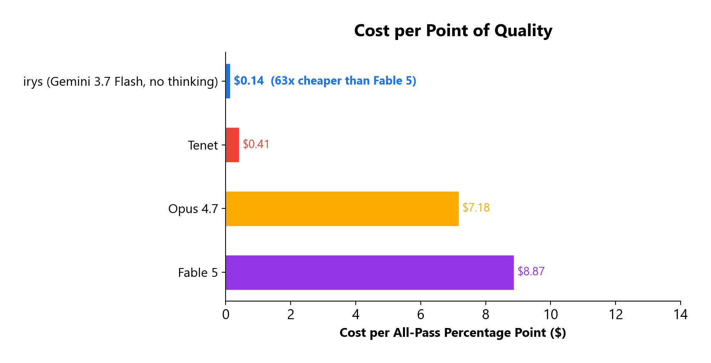
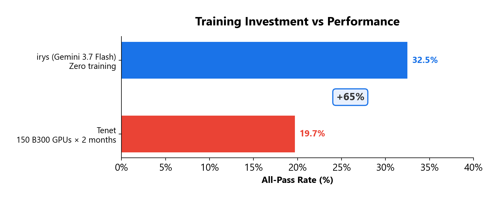
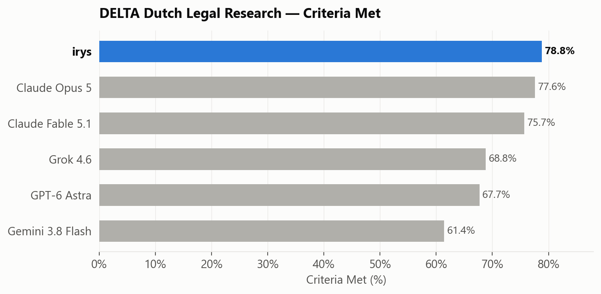
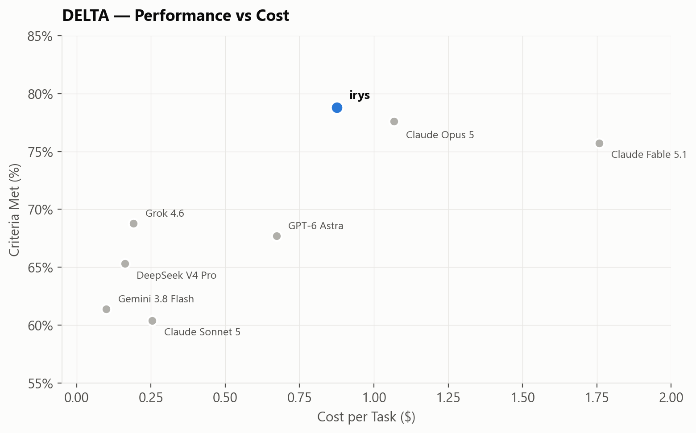

# irys — stateful swarms

**The #1 all-pass rate on [Harvey LAB](https://github.com/harveyai/harvey-labs). No fine-tuning — just Gemini 3.7 Flash (no thinking) and a coordination architecture that makes cheap models outperform expensive ones.**

## At a glance

### Harvey Legal Agent Benchmark — 2,010 tasks, 27 practice areas

- **32.5% all-pass** — #1 of all systems, 65% higher than Harvey's own Tenet (19.7%)
- **$4.64/task** — **62x** more intelligence per dollar than Fable 5, **50x** more than Opus 4.7
- Beats a model post-trained on **150 NVIDIA B300 GPUs for 2 months** with **zero training compute**



### DELTA Dutch Legal Research — 15 tasks, 273 criteria, official GPT-5.6 Sol judge

- **78.8% criteria** — #1 on the leaderboard, above Opus 5 (77.6%) and Fable 5.1 (75.7%)
- **86.3% citation accuracy** — iterative blackboard reasoning builds deeper source coverage than any system on the leaderboard
- **$0.876/task** — cheaper than Opus 5 ($1.07) and Fable 5.1 ($1.76)



**No fine-tuning. No custom training data. No domain-specific scaffolding. Architecture beats raw intelligence.**








For a technical discussion of the stateful swarm paradigm, see [Stateful Swarms Make AI Agents Cheaper, Safer, Better](https://www.linkedin.com/pulse/stateful-swarms-make-ai-agents-cheaper-safer-better-devansh-devansh-8enxe).

---

## Contents

- [Harvey Legal Agent Benchmark (LAB)](#harvey-legal-agent-benchmark-lab)
- [DELTA Dutch legal research benchmark](#delta-dutch-legal-research-benchmark)
- [How stateful swarms reason](#how-stateful-swarms-reason)
- [Why stateful swarms matter](#why-stateful-swarms-matter)
- [The stateful advantage](#the-stateful-advantage)
- [Blackboard MCP: Claude Code and Codex](#blackboard-mcp-use-stateful-reasoning-in-claude-code-and-codex)
- [Complementary research](#complementary-research)
- [Other evaluations](#other-evaluations)

---

## Harvey Legal Agent Benchmark (LAB)

irys completed the full [Harvey LAB v1.0](https://github.com/harveyai/harvey-labs): 2,010 tasks across 27 legal practice areas, including 250 firm-knowledge tasks over a shared 9,288-document DMS. Every task starts from an empty blackboard with zero prior state.

| Metric | Result |
|---|---|
| Strict all-pass | **654 / 2,010 = 32.5%** |
| Criteria macro | **91.44%** |
| Tasks at 95%+ | 1,260 / 2,010 = 62.7% |
| Cost per task | **$4.64** |
| Total cost | $9,317 |

### Benchmark comparison

Harvey published official LAB results in their [Tenet Research Preview](https://www.harvey.ai/blog/post-training-update-harvey-tenet) (August 2026). irys ran on the full public set (2,010 tasks); competitor all-pass rates are from Harvey's holdout set (~1,200 tasks).

| System | LAB All-Pass | Est. Cost/Task |
|---|---:|---:|
| **irys (Gemini 3.7 Flash, no thinking)** | **32.5%** | **$4.64** |
| Muse Spark 1.1 | 20.0% | ~$0.50 |
| Harvey Tenet (Kimi K3 + RL) | 19.7% | ~$8 |
| Grok 4.5 | 12.9% | ~$1 |
| Fable 5 | 11.5% | ~$102 |
| Kimi K3 (base) | 10.8% | ~$8 |
| DeepSeek V4 Flash | 8.3% | ~$0.40 |
| Opus 4.7 | 7.1% | ~$51 |
| GLM-5.2 | 7.1% | — |
| Opus 5 | 6.7% | ~$51 |
| Gemini 3.6 Flash | 3.3% | ~$2 |
| GPT-5.6 Sol | 2.5% | ~$12 |

irys delivers **62x** the intelligence per dollar of Fable 5, **50x** Opus 4.7, and **2.8x** Harvey Tenet — with no fine-tuning, no custom training data, and no domain-specific scaffolding.

Harvey Tenet is a Kimi K3 base model post-trained with reinforcement learning on ~1,750 legal task environments over 2 months on 150 NVIDIA B300 GPUs. Despite that investment, irys — a pure coordination architecture — achieves 65% higher all-pass.

<details>
<summary>Frontier cost analysis</summary>

Harvey's [initial LAB publication](https://www.harvey.ai/blog/legal-agent-benchmark-initial-results) (May 2026) reported that Claude Opus 4.7 cost **~$51/task** at 7.1% all-pass. This published cost serves as the baseline for estimating newer Claude models, since all share the same tokenizer:

| Model | Input (per MTok) | Output (per MTok) | Per-Token vs Opus 4.7 | Est. LAB Cost/Task |
|---|---:|---:|---|---:|
| Claude Opus 4.7 (published baseline) | $5.00 | $25.00 | 1x | **~$51** |
| Claude Opus 5 | $5.00 | $25.00 | 1x | **~$51** |
| Claude Fable 5 | $10.00 | $50.00 | 2x | **~$102** |

#### Head-to-head

| | **irys** | Harvey Tenet | Fable 5 | Opus 4.7 |
|---|---:|---:|---:|---:|
| LAB All-Pass | **32.5%** | 19.7% | 11.5% | 7.1% |
| Cost/Task | **$4.64** | ~$8 | ~$102 | ~$51 |
| All-pass per dollar | **7.00** | 2.46 | 0.11 | 0.14 |
| Cost per all-pass point | **$0.14** | $0.41 | $8.87 | $7.18 |
| Training investment | **Zero** | 150 B300 GPUs, 2 months | — | — |

The most expensive frontier models deliver the worst results — Fable 5 at ~$102/task achieves only 11.5% all-pass, spending 22x what irys costs for 65% lower performance.

> **A note on benchmark versions:** Opus 4.7 cost (~$51/task) was measured on the **original** LAB release (1,251 tasks, 24 families). LAB v1.0 added substantially harder tasks — including 250 firm-knowledge tasks over a 9,288-document DMS — so real frontier costs on v1.0 would likely exceed these estimates. irys cost ($4.64/task) is on the harder v1.0 benchmark.
>
> Harvey's published all-pass results are on their private holdout set (~1,200 tasks). A direct apples-to-apples cost comparison is not possible. Opus 4.7 cost from Harvey's [initial publication](https://www.harvey.ai/blog/legal-agent-benchmark-initial-results). Fable 5 and Opus 5 costs estimated from published per-token pricing. Other costs from Harvey's [Tenet Research Preview](https://www.harvey.ai/blog/post-training-update-harvey-tenet).

<details>
<summary>What $100 buys on LAB</summary>

| System | Tasks per $100 | All-pass rate | Expected all-pass tasks per $100 |
|---|---:|---:|---:|
| **irys (Gemini 3.7 Flash, no thinking)** | **21.6** | **32.5%** | **7.0** |
| Harvey Tenet | 12.5 | 19.7% | 2.5 |
| Opus 4.7 | 2.0 | 7.1% | 0.14 |
| Fable 5 | 1.0 | 11.5% | 0.11 |

</details>

<details>
<summary>Post-training vs coordination architecture</summary>

| Approach | Base Model | Method | LAB All-Pass | Uplift |
|---|---|---|---:|---:|
| Raw model | Kimi K3 | None | 10.8% | — |
| Post-training | Kimi K3 | LoRA + GSPO, 150 B300 GPUs, 2 months | 19.7% | +82% |
| Coordination architecture | General-purpose models | Stateful swarms, zero training | **32.5%** | **+201%** |

Harvey invested in domain-specific post-training: RL over ~1,750 legal environments on 150 GPUs for 2 months. That lifted Kimi K3 from 10.8% to 19.7% (+82%). irys achieves +201% over the same baseline with zero training compute.

</details>

</details>

<details>
<summary>Methodology and verification</summary>

**Verification.** The complete outputs from the full benchmark run are available as downloadable archives in [GitHub Releases](https://github.com/dl1683/irys-stateful-swarms/releases). You can score these outputs yourself using the [Harvey LAB scorer](https://github.com/harveyai/harvey-labs) to independently verify these numbers.

**Scoring.** We use Gemini 3.5 Flash Lite as judge for Harvey LAB because it is intelligent, cheap, and handles rate limits well for high-throughput scoring. We have run cross-judge validation to ensure agreement with other judge models. You are free to rescore the entire run with the judge of your choice — the raw outputs are published.

**Context.** The published run uses the public LAB task set. Private holdout results are not directly interchangeable with public-set results, so this README makes no claim of private-holdout equivalence.

**Architecture is the public claim.** The result measures the complete system, not an isolated model. The repository makes no model-specific performance attribution. Its reusable contribution is the coordination architecture: structured state-building, typed provenance, signal-driven gap identification, and multi-iteration convergence.

</details>

---

## DELTA Dutch legal research benchmark

[DELTA](https://github.com/legalbenchmarks/delta) (v1.1.0) is a Dutch legal research benchmark from [Legal Benchmarks](https://www.legalbenchmarks.ai): 15 research tasks, 273 binary criteria. Scored with GPT-5.6 Sol — the same judge model used in the official DELTA evaluation pipeline.

The stateful swarm was originally built for document analysis, not pure research tasks. Running DELTA required adapting the system to work without input documents, relying entirely on web search (DuckDuckGo + trafilatura) to build its blackboard state.

| Metric | Result |
|---|---:|
| Criteria met | **215/273 (78.8%)** |
| Substance | 157/192 (81.8%) |
| Citation | 44/51 (86.3%) |
| Form | 14/30 (46.7%) |
| Cost per task | $0.876 |

### Leaderboard context

The [DELTA leaderboard](https://www.legalbenchmarks.ai) publishes results from official submissions scored by the same GPT-5.6 Sol judge:

| System | Criteria Met | Cost/Task |
|---|---:|---:|
| **irys (Gemini 3.7 Flash, no thinking)** | **78.8%** | **$0.876** |
| Claude Opus 5 | 77.6% | $1.068 |
| Claude Fable 5.1 | 75.7% | $1.758 |
| Grok 4.6 | 68.8% | $0.191 |
| GPT-6 Astra | 67.7% | $0.672 |
| Gemini 3.8 Flash | 61.4% | $0.100 |

irys achieves the **highest criteria score** on the leaderboard at **lower cost** than both Opus 5 ($1.07) and Fable 5.1 ($1.76).





<details>
<summary>Per-task breakdown</summary>

| Task | Score |
|---|---:|
| employment-law/inappropriate-conduct-in-the-workplace | 21/22 (95.5%) |
| competition-law/acm-concentration-notification | 17/18 (94.4%) |
| contract-law/contractual-terms-outside-6-5-3-bw | 22/24 (91.7%) |
| property-law/successive-deliveries-movable | 22/24 (91.7%) |
| corporate-law/director-supervisory-board-conflicts | 15/17 (88.2%) |
| property-law/acquisition-of-a-stolen-movable | 21/24 (87.5%) |
| insolvency/pledgee-settlement-authority | 15/19 (78.9%) |
| tort-law/product-liability-for-blood | 14/18 (77.8%) |
| tort-law/animal-liability-and-exoneration | 13/17 (76.5%) |
| insolvency/director-liability-selective-payments | 10/14 (71.4%) |
| tort-law/duty-to-warn | 9/14 (64.3%) |
| corporate-law/instruction-power-general-meeting | 12/19 (63.2%) |
| real-estate/interpretation-notarial-deeds | 9/15 (60.0%) |
| real-estate/ground-rent-revision | 10/17 (58.8%) |
| family-law/minor-representative-conflict | 5/11 (45.5%) |

</details>

<details>
<summary>Methodology and caveats</summary>

- **We are submitting our API for official DELTA judging.** Official evaluation includes binding rulings from qualified Dutch lawyers that we cannot replicate locally. Once official results are published, we will update this section accordingly.
- **System prompt deviation.** The DELTA protocol specifies a fixed legal-domain system prompt. Our harness uses a domain-agnostic prompt ("senior expert" instead of "experienced legal practitioner"). This is consistent across all runs and disclosed for transparency.
- **Swarm form scores.** The swarm's 46.7% form score reflects output formatting, not knowledge quality. The swarm produces comprehensive structured memos that exceed the conciseness expectations of some form criteria.
- **We're publishing our results live.** The complete benchmark outputs — answers and scores — are available as a downloadable archive in [GitHub Releases](https://github.com/dl1683/irys-stateful-swarms/releases). The harness code is at [`benchmarks/delta/`](benchmarks/delta/).

</details>

---

## How stateful swarms reason

Each task produces a **blackboard** — persistent structured state that evolves over multiple iterations as workers read documents, extract evidence, cross-reference findings, and build toward a complete answer. The blackboard is the core artifact: not the final output, but the accumulated understanding that produced it.

A complete example is in [`examples/compare-credit-agreement-to-commitment-letter/`](examples/compare-credit-agreement-to-commitment-letter/) — a banking task that scored **40/40 (perfect)**:

**Iteration 0** — The system plans before it reads. A seed planner scans document structure, produces a strategy, and generates targeted signals (questions workers must answer). **7 entries, 12 open signals.** The swarm knows what it's looking for before reading a single page.

**Iteration 5** — Parallel workers extract grounded evidence. Each observation links to its source document, section, and evidence. Workers also flag gaps — incomplete extraction linked back to the signals they're trying to answer. **2,203 entries:** 2,023 observations, 78 calculations, 54 analyses, 41 gaps, 7 strategies.

**Iteration 12** — Cross-document analysis reveals deviations. The system finds 10+ material deviations — unauthorized margin increases, missing fee definitions, tightened covenant triggers — each grounded in specific clauses from specific documents. **Final state: 2,400 entries.** 210 signals — 127 addressed, 45 open, 38 expired.

From 7 entries to 2,400 grounded findings — a **343x expansion** of structured analytical state over 12 iterations.

**This is what statefulness means.** In a stateless system, all 2,400 entries would be discarded. The next question about the same credit agreement starts from zero. In a stateful swarm, this analytical state persists. The next question costs a fraction of the first.

<details>
<summary>Full worked example with blackboard snapshots</summary>

### Iteration 0 — Planning

```json
{
  "id": "e564",
  "type": "strategy",
  "content": "This is a comparison and issue-flagging task supported by targeted extraction. The approach involves extracting the baseline terms from the term sheet, commitment letter, and no-flex confirmation, extracting the corresponding drafted terms from the draft credit agreement, and performing a side-by-side gap analysis to identify any deviations, unauthorized changes, or missing provisions.",
  "created_by": {
    "worker_id": "seed_planner",
    "description": "analytical_framework",
    "iteration": 0
  }
}
```

Signals generated:

```json
{
  "id": "s341",
  "type": "question",
  "content": "What are the exact interest rate margins, SOFR floors, and OID for Term Loan B in the draft credit agreement, and do they match the term sheet and commitment letter?",
  "priority": "high",
  "status": "open"
}
```

```json
{
  "id": "s346",
  "type": "question",
  "content": "What are the Asset Sale Prepayment terms (net proceeds percentage, annual threshold, reinvestment periods, cash consideration requirement) in the draft credit agreement, and do they deviate from the term sheet?",
  "priority": "high",
  "status": "open"
}
```

### Iteration 5 — Grounded extraction

```json
{
  "id": "e716",
  "type": "observation",
  "content": "Northbrook Capital Markets, LLC commits to provide a first lien senior secured term loan B facility in an aggregate principal amount of $350,000,000.",
  "source": {
    "document": "commitment-letter.docx",
    "section": "Full Document (part 1)"
  },
  "confidence": 0.9
}
```

Gap detection:

```json
{
  "id": "e1977",
  "type": "gap",
  "content": "Rows 1.0 through 5.0 and 7.0 through 50.0 are currently unextracted from comparison-template.xlsx.",
  "source": {
    "document": "comparison-template.xlsx",
    "evidence": "Document 'comparison-template.xlsx' has ~50 enumerable items but only 0 extracted."
  },
  "addresses_signals": ["s483"]
}
```

### Iteration 12 — Cross-document analysis

```json
{
  "id": "e865",
  "type": "analysis",
  "content": "Section 2.06 of the draft credit agreement specifies an annual agency fee of $50,000. This is a deviation from the Commitment Letter, which requires an Administrative Agent Fee of $150,000 per annum, payable annually in advance.",
  "source": {
    "document": "draft-credit-agreement.docx"
  },
  "confidence": 0.98,
  "supports": ["e260", "e261", "e35"]
}
```

```json
{
  "id": "e2331",
  "type": "gap",
  "content": "The 6-month soft call provision is absent from the draft credit agreement.",
  "source": {
    "document": "comparison-template.xlsx",
    "section": "6.0",
    "evidence": "Section 6.0 (Term Loan B — Voluntary Prepayment / Soft Call) shows no mapping to the draft credit agreement."
  },
  "confidence": 0.98
}
```

</details>

<details>
<summary>When it doesn't get a perfect score, you can see exactly why</summary>

Not every task scores perfectly — but the blackboard makes failures **auditable**. You can trace exactly what the system knew, what it missed, and where the reasoning fell short.

**International Sanctions Entity Extraction** ([`examples/extract-transaction-entity-details/`](examples/extract-transaction-entity-details/)) — **80/85**.

- **Missed "Haverford National Bank as OCC-chartered national bank"** — the system found the bank name, address, and SWIFT code, but didn't identify the charter type. The fact was there; the classification step was missing.
- **Missed "Isabelle M. Renard — confirm Swiss/French dual nationality"** — the system extracted "Switzerland / France" but didn't explicitly flag this as *dual nationality* in a way the scorer recognized.
- **Missed "Beneficiary name inconsistency"** — both "Zenith Petrochem" and "Zenith Petrochemical" were in the blackboard. The discrepancy was *visible in the state* but no worker explicitly flagged it.
- **Missed "OFAC 50% rule aggregation principle"** — the system identified the 49% threshold proximity and mentioned aggregation, but didn't elaborate on the aggregation *principle* with enough specificity.

**UCC Lien Extraction** ([`examples/extract-lien-and-debt-information/`](examples/extract-lien-and-debt-information/)) — **54/59**.

- **Missed "Debtor name discrepancy between filings"** — "Pinnacle Industrial Solutions, Inc." in one entry, "Pinnacle Industrial Solutions" (without Inc.) in another. The variance existed in the blackboard but wasn't flagged.
- **Missed "PMSI super-priority under UCC §9-324(a)"** — the system found the PMSI, recognized it may have super-priority, but didn't cite the specific UCC section.

**The pattern:** In every near-miss, the raw information was in the blackboard. What's missing is the final verification step — the explicit cross-reference, the legal citation, the formal classification. These are fixable through better state processing, not fundamental architectural limitations.

</details>

### Explore the examples

| Example | Domain | Score | What it shows |
|---|---|---:|---|
| [`compare-credit-agreement-to-commitment-letter/`](examples/compare-credit-agreement-to-commitment-letter/) | Banking | 40/40 | Perfect cross-document deviation analysis |
| [`draft-safe-agreement/`](examples/draft-safe-agreement/) | Venture Capital | 69/69 | Perfect generative drafting |
| [`extract-transaction-entity-details/`](examples/extract-transaction-entity-details/) | Sanctions | 80/85 | Near-miss: entities found, specifics missed |
| [`extract-lien-and-debt-information/`](examples/extract-lien-and-debt-information/) | Banking/UCC | 54/59 | Near-miss: facts extracted, cross-references missed |
| [`compare-merger-remedies/`](examples/compare-merger-remedies/) | Antitrust | 56/61 | Near-miss: complex multi-jurisdiction comparison |
| [`datadog-strategic-analysis/`](examples/datadog-strategic-analysis/) | Finance/SEC | N/A | Domain-agnostic proof: 7 10-K filings, 12,657-word investment memo ([comparison](examples/datadog-strategic-analysis/COMPARISON.md)) |

Browse any task's `swarm/blackboard_iter_*.json` files to trace the full reasoning evolution. Complete outputs for all 2,010 tasks are available in [GitHub Releases](https://github.com/dl1683/irys-stateful-swarms/releases).

---

## Why stateful swarms matter

Every major AI system today treats each interaction as an isolated event. The model reasons, produces output, and forgets. Context windows get compacted. Session boundaries erase everything. A system that forgets what it learned yesterday will always pay the full cost of understanding today.

**Stateful swarms break this cycle.** The blackboard is not a temporary scratchpad — it is persistent, typed, provenance-tracked analytical state that survives across sessions and accumulates over time. The cost of understanding a document set is paid once. Every subsequent interaction builds on what came before.

irys achieves its benchmark results using **only API calls** to standard language models — no fine-tuning, no custom embeddings, no latent space manipulation. The entire system is coordination logic and structured state management.

---

## The stateful advantage

The benchmark results were achieved under the hardest possible condition: **zero prior state.** Every task starts from an empty blackboard. In production, [Irys](https://www.irys.ai) maintains persistent document indexes, entity graphs, and matter-level context across sessions. The benchmark deliberately strips all of that away.

**What the benchmark excludes:**

- **Proprietary document ingestion** — hierarchical structural parsing, section-level embeddings, table extraction. On the benchmark, the system reads raw documents from scratch every time.
- **Persistent knowledge graphs** — entity linking, obligation tracking, cross-document relationship resolution. The benchmark starts with an empty graph per task.
- **Blackboard reuse** — in production, analytical state from prior queries persists and compounds. The benchmark forbids reuse.
- **DMS-optimized retrieval** — the firm-knowledge family (250 tasks, 9,288 shared documents) is the exact use case Irys's ingestion pipeline is designed for.

These capabilities would have the largest impact on exactly the tasks where building prior state eliminates redundant work. The 32.5% all-pass rate reflects none of that advantage.

**The production multiplier.** [Irys](https://www.irys.ai) combines stateful swarm coordination with hierarchical embeddings, persistent knowledge graphs, entity linking, and typed provenance tracking to reduce the cost of multi-turn inference by up to **1,000x** compared to stateless re-computation. Provenance tracking allows the system to deterministically isolate exactly which state needs updating when new information arrives — rather than re-processing everything, it targets only the affected subgraph. Combined with deterministic algorithms for entity resolution, obligation tracking, and conflict detection, the vast majority of follow-up work never touches an LLM at all.

This is the economic case for stateful swarms: the cost of AI-assisted analysis shifts from "pay full price for every question" to "invest in understanding once, then query cheaply forever."

---

## Blackboard MCP: use stateful reasoning in Claude Code and Codex

The blackboard reasoning system that powers irys is available as a standalone MCP server at [`packages/blackboard-mcp/`](packages/blackboard-mcp/). It gives any AI agent persistent structured reasoning — zero API calls, zero cost.

**What it does:** 14 tools for creating and managing blackboards — typed entries (observation, analysis, calculation, strategy, gap), automatic contradiction detection with confidence decay, signal tracking, convergence gating, cross-session persistence, and document provenance.

**Why it matters:** When you install this in Claude Code or Codex, your agent gains persistent analytical state. A blackboard created during one session is discoverable in the next — the agent calls `bb_list`, finds prior work, and extends it instead of starting from scratch.

**Interactive exports:** Call `bb_export` to generate a self-contained HTML file with an interactive knowledge graph — force-directed layout, cluster detection, evidence chains, confidence gauges, and a structured briefing. Single file, zero dependencies, works offline.

**Graph overview with briefing panel** — 146 findings from a Datadog financial analysis:


**Node detail panel** — click any node to see full content, confidence, provenance, and connections:


**Source fragility analysis** — what breaks if you remove each source document:


### Install

Published on npm as [`@iqidis/blackboard-mcp`](https://www.npmjs.com/package/@iqidis/blackboard-mcp):

**Claude Code** (one-liner):
```bash
claude mcp add blackboard -- npx @iqidis/blackboard-mcp
```

Or add directly to `.mcp.json`:
```json
{
  "mcpServers": {
    "blackboard": {
      "type": "stdio",
      "command": "npx",
      "args": ["@iqidis/blackboard-mcp"]
    }
  }
}
```

**Codex CLI** (`~/.codex/config.toml`):
```toml
[mcp_servers.blackboard]
command = "npx"
args = ["-y", "@iqidis/blackboard-mcp"]
```

**From source:**
```bash
cd packages/blackboard-mcp && npm install && npm run build
node dist/index.js
```

A packaged Claude Code plugin is also available at [`packages/blackboard-mcp/claude-plugin/`](packages/blackboard-mcp/claude-plugin/). See [`packages/blackboard-mcp/SETUP.md`](packages/blackboard-mcp/SETUP.md) for details.

---

<details>
<summary><h2>Complementary research</h2></summary>

The stateful swarm paradigm is not legal-specific. We've open-sourced several systems that address the layers surrounding stateful swarm coordination:

---

**[Latent Space Reasoning](https://github.com/dl1683/Latent-Space-Reasoning)** — Can a frozen language model reason better without any training? Yes, by controlling the model's latent trajectories at inference time through diffusion denoise repair.

Results: **+19.6pp arithmetic improvement** on Qwen3-4B (32% to 51.6%) using just 2-token random prefix perturbation with zero training. Frontier diffusion repair mode achieves score 0.531 vs 0.413 greedy baseline (+28.8%) on planning tasks. Oracle coverage reaches 100% across 25 diverse reasoning tasks from just 10 two-token directions. Validated across Qwen3 (0.6B, 1.7B, 4B, 8B), DeepSeek-1.5B, phi-2, and LLaDA-MoE (7B).

For stateful swarms, this suggests a research path for improving worker reasoning without changing the coordination architecture.

---

**[Fractal Embeddings](https://github.com/dl1683/moonshot-fractal-embeddings)** — Standard dense retrievers treat all embedding dimensions equally. Fractal Embeddings align dimensional structure to semantic hierarchy: 64 dims capture domain (L0), 128 dims capture category (L1), full 384 dims capture fine-grained intent.

Key finding: **class separation ratio predicts representation quality with R²=0.554**, validated causally through rank-constrained perturbation surgery. Correct geometric hierarchy **causally improves** embedding quality, while wrong hierarchy actively hurts. Validated across 6 NLP encoder architectures, vision models (ViT-Large, ResNet-50), and biological neural systems (32 mouse V1 Neuropixels sessions — 30/32 PASS, mean r=0.736).

For document analysis, this is the difference between an embedding that treats a contract clause the same regardless of context, and one that natively understands hierarchical structure.

---

**[CTI Universal Law](https://github.com/dl1683/moonshot-cti-universal-law)** — Why does representation quality follow particular patterns across architectures, datasets, and biological neural systems? This project derives the answer from first principles using extreme value theory, producing a universal law that is *proven, not fitted*.

Leave-one-architecture-out cross-validation across 192 data points yields **α=1.477 with CV=2.3% and R²=0.955**. Causal evidence: confusion-matrix causal prediction achieves r=0.842 with 93-100% sign accuracy (p<10⁻³⁵). Cross-model ranking across 9 architectures achieves Spearman ρ=0.833 (p=0.005) — κ values predict MAP@10 ranking without running retrieval. Generalizes to biological systems: 30/32 mouse V1 sessions PASS with mean r=0.736.

---

**[MapU](https://github.com/dl1683/MapU)** *(active development)* — Persistent, provenance-backed knowledge memory for agentic systems. Every assertion carries source attribution, confidence, temporal validity, and conflict state. 14 MCP tools for agent integration, plus REST API, CLI, and Python package surfaces, backed by PostgreSQL with pgvector. This is the persistence layer that makes stateful swarms practical in production.

---

A production stateful swarm combines coordination (irys-stateful-swarms) with improved reasoning (Latent Space), better representations (Fractal Embeddings, CTI), and persistent memory (MapU). Each layer reinforces the others. We're releasing each piece independently so the community can explore these directions.

</details>

---

## Other evaluations

The stateful swarm paradigm is not legal-specific. Task decomposition, persistent blackboard state-building, and multi-agent coordination with typed provenance apply to any domain where professionals build understanding through analysis of complex documents.

### SWE-bench Verified: preliminary scaffold evaluation

A preliminary [SWE-bench Verified](https://www.swebench.com/) run explored Blackboard MCP under a thin wrapper. Patch-production gaps and environment failures left incomplete coverage, so the current artifacts are not suitable for a headline comparison. Working materials are under `benchmarks/swebench/` and should be rerun under a publication-safe manifest.

### Datadog 10-K strategic analysis

With zero code changes, we pointed irys at seven Datadog 10-K annual filings (FY2019–FY2025) and asked for a strategic-priority analysis. The system produced a 12,657-word investment memo tracing product strategy, go-to-market changes, competitive positioning, financial trajectory, and risk factors. This is qualitative evidence of domain transfer, not a controlled benchmark result.

---

We're actively running the system across multiple benchmarks spanning different fields of knowledge work. If you're working on benchmarks for knowledge-intensive tasks and would be interested in partnering or having irys evaluated on your benchmark, reach out at [devansh@iqidis.ai](mailto:devansh@iqidis.ai).
